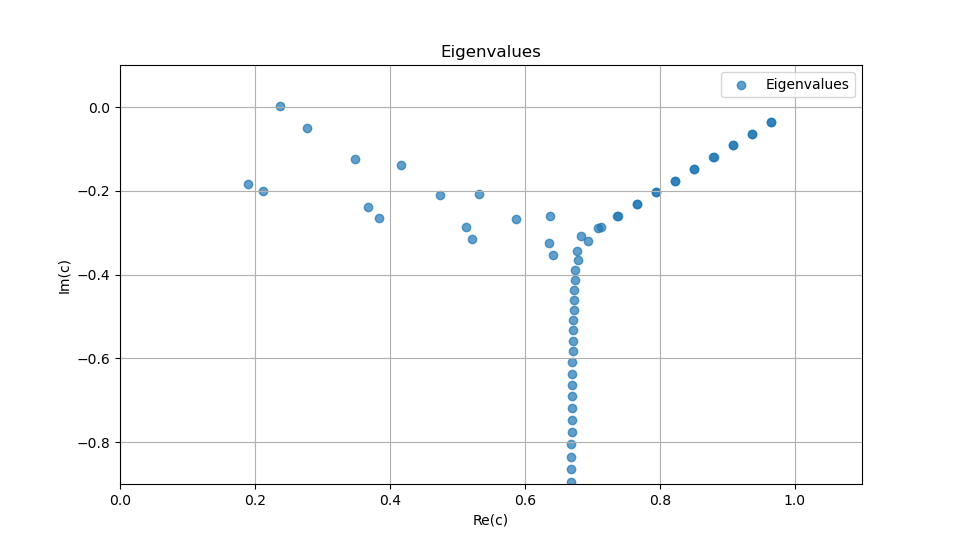
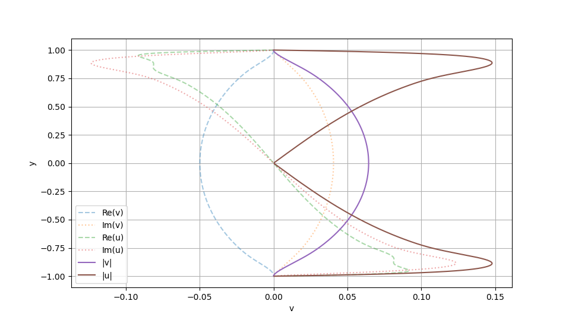
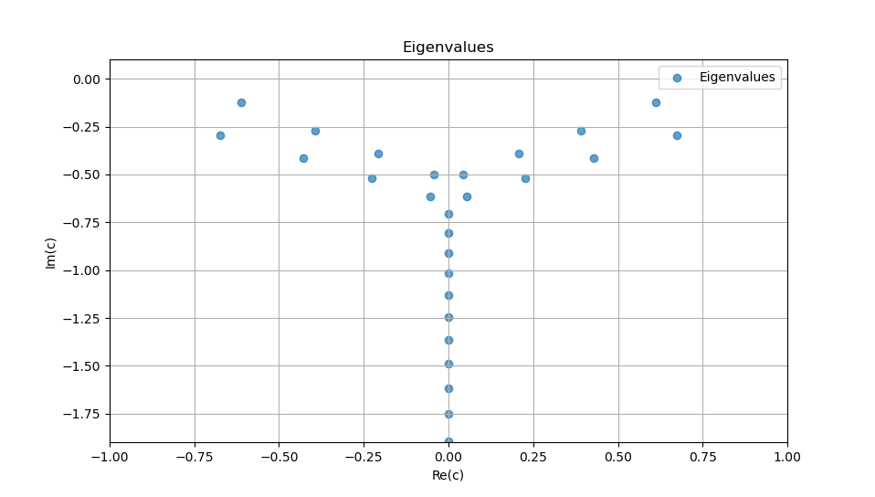
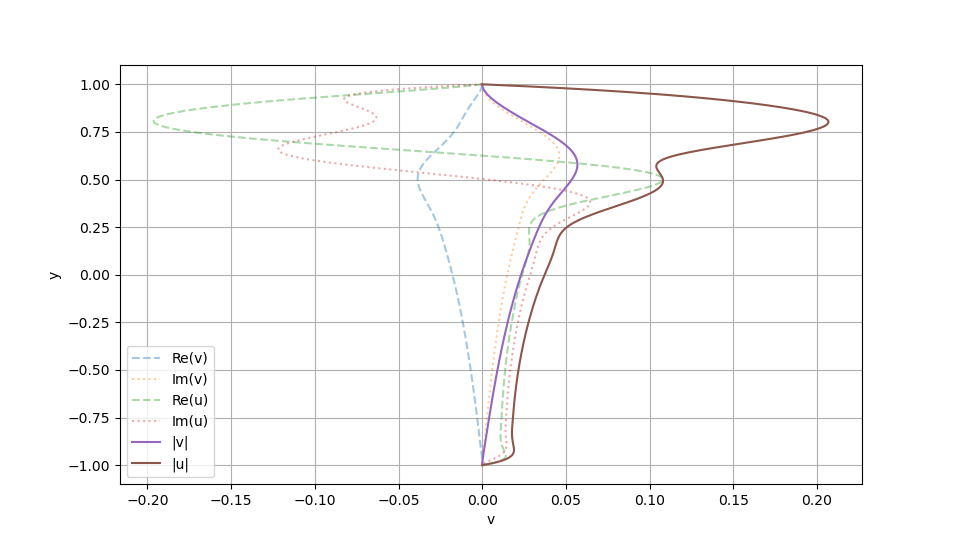
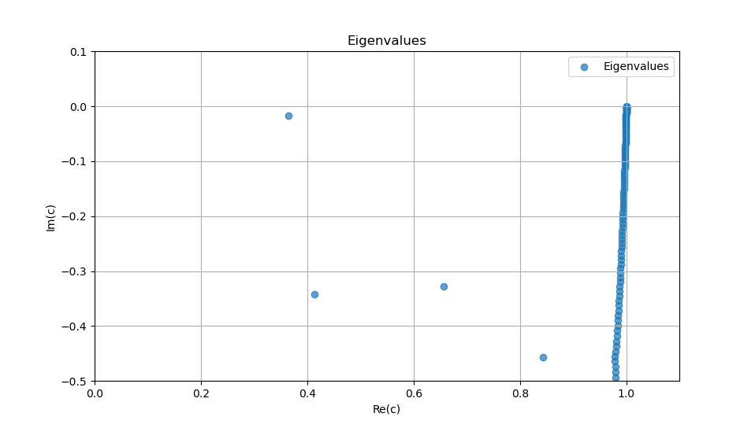
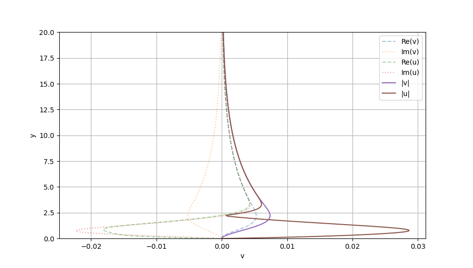

# Solver for the Orr-Sommerfeld equation

Solver of the Orr Sommerfeld equation, both for the temporal (verified) and spatial stability analysis (not verified, use at your own risk). The code follows the work of: 

_Kirchner, N.P. (2000), Computational aspects of the spectral Galerkin FEM for the Orr–Sommerfeld equation. Int. J. Numer. Meth. Fluids, 32: 105-121. [https://doi.org/10.1002](https://doi.org/10.1002/(SICI)1097-0363(20000115)32:1<105::AID-FLD938>3.0.CO;2-X)_

The paper can be found in `docs/spectralElementMethodOrrSommerfeld_0.pdf`. The Galerkin method has the advantage of avoiding the appearance of spurious eigenvalues, which is a common issue in collocation-based spectral codes.

The notation and eigenvalue problems are taken from the book:

_Schmid, P. J., & Henningson, D. S. (2001). Stability and transition in shear flows. Springer._

## Requirements

- Python 3.7 or later
- cmake
- gcc
- Eigen library

## Installation

Copy this repository to your local machine:

```bash
git clone git@github.com:victorballester7/orrSommerfeldSolver.git
cd orrSommerfeldSolver
make
```

## Usage

All the parameters to change are in the `config/input.toml` file. The comments should be self-explanatory. Once the user has selected the parameters, the user can run the code with:

```bash
make run
```


## Results

### Poiseuille flow

The Poiseulle flow is defined by a staeady state of the form: $`u(y) = 1 - y^2`$, with $`y \in [-1, 1]`$. The eigenvalues $`c = \omega/\alpha`$ from the dispersive relation are plotted below in the case $`\alpha = 1`$, $`\beta = 0`$ and $`\text{Re} = 10000`$.



The eigenvector corresponding to the most unstable eigenvalue is:



### Couette flow

The Couette flow is defined by a staeady state of the form: $u(y) = y$, with $y \in [-1, 1]$. The eigenvalues $c$ are plotted below in the case $\alpha = \beta = 1$ and $\text{Re} = 1000$.



The eigenvector corresponding to the most unstable eigenvalue is:



### Boundary Layer

The laminar boundary layer profile is taken from the Blasius solution. The data of the solution (solved in the interval $\eta \in [0, 150]$) is stored in the file `data/blasius.dat`. The eigenvalues $c$ are plotted below in the case $\alpha = 0.2$, $\beta = 0$ and $\text{Re} = 500$.



The eigenvector corresponding to the most unstable eigenvalue is:




